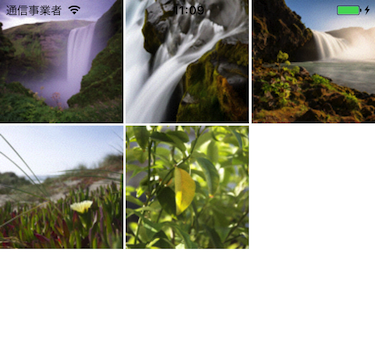

Image-Picker
===========

[](https://developer.apple.com/iphone/index.action)
[](https://developer.apple.com/swift)
[](http://mit-license.org)

# Overview
This is a sample program that creates a simple image picker like the camera roll.
In the ImagePickerViewController, create a CollectionView and display the image from the PHAsset obtained with PHFetchResult.



You can easily change the number of columns and margins by changing the following constant.
```
fileprivate let kColumnCnt: Int = 3
fileprivate let kCellSpacing: CGFloat = 2
```

## Author

**R. Ayakix**

- Past works: [Product list](http://ayakix.com/) / [Waaaaay!](http://waaaaay.com/)
- Blogs: [English](https://medium.com/@Ayakix) / [Japanese](http://blog.ayakix.com/)
- Contact: [Twitter](https://twitter.com/ayakix)

## Acknowledgements
- This tips was developed in [Snapmart](https://snapmart.jp/)
